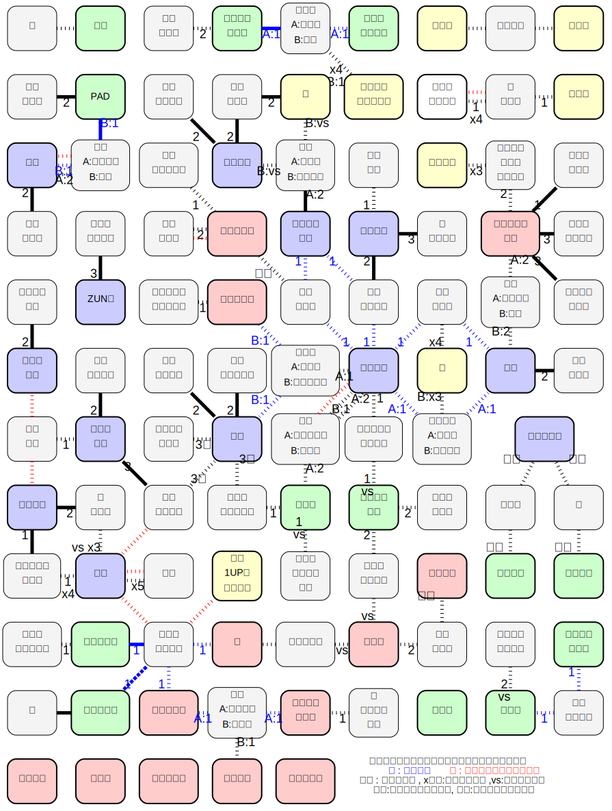

# 意思決定用チャート

## 成功確率(%)

- デジカメ,携帯 獲得確率 :: 28% → 67% → 100%
- 希望アイテム獲得確率 :: 22% → 33~44% → 100%
- 回数 :: ボム未使用 / ボム1回以内 (ボムは2回以上使っても高々0~5%しか増えない)

|回数\精神力|4|5|6|7|8|9|10|11|
|:-:|:-|:-:|:-:|:-:|:-:|:-:|:-:|:-:|
|1|16 / 30|27 / 47|41 / 65|58 / 81|72 / 92|82 / 97|91 / 99|97 / 99|
|2|3 / 7|7 / 18|17 / 37|33 / 62|52 / 80|69 / 92|83 / 97|94 / 99|
|3|0 / 1|2 / 7|6 / 19|20 / 45|37 / 68|58 / 86|76 / 96|92 / 99|
|4|0 / 0|0 / 2|2 / 10|11 / 31|26 / 57|48 / 80|71 / 94|89 / 99|
|5|0 / 0|0 / 0|1 / 5|6 / 21|19 / 46|40 / 73|64 / 91|87 / 99|

## 常時発動の耐性

- 残機 + 1 に変化も含む. 特殊な状況,特定の場所でのみ無効なものは記載されていない

|能力|該当キャラ|
|:-|:-|
|休み無効|咲夜 芳香|
|食あたり無効|幽々子 ミスティア メディスン 妹紅 芳香|
|毒茸無効|幽々子 メディスン 華扇 妹紅  芳香|
|飲み過ぎ無効|幽々子 ミスティア 華扇 萃香 勇儀|
|呪い無効|幽々子 こいし チルノ 雛 諏訪子 芳香|
|迷い無効|四季映姫 こいし てゐ 華扇  藍(2D) 永琳(2D)|
|幻覚無効|四季映姫 こいし メディスン 一輪 神奈子 藍(2D) 優曇華院(2D) 永琳(2D) マミゾウ(2D)|

## 2人以上が持つ特定用の頻出な特殊能力

|能力|該当キャラ|
|:-|:-|
|ボムで地形カード操作 | 慧音 神奈子 諏訪子 衣玖 マミゾウ|
|所持アイテム無制限 | 魔理沙 優曇華院 永琳 輝夜 雛 にとり|
|アイテム強奪 | 雛 小傘 華扇 咲夜 燐 小町 燐|
|ダイス反転 | 霊夢 魔理沙 早苗 てゐ 衣玖(B)|
|成功・失敗判定変更|てゐ レミリア 早苗 雛|
|待機カウンター + 1|ナズーリン パチュリー にとり|
|移動2 でも得られる|秋姉妹 ナズーリン 星|
|手番終了時 残機減少攻撃|フラン メディスン 村紗|
|正体を特殊に確認|文(自) はたて(自) ルーミア|
|地形効果無視|天子(2D) 布都(B) 藍|
|2マス以上移動|文 青娥 紫(1D)|
|端から端へ移動|小町 青娥|
|戦闘回避|幽々子(幽霊) 四季映姫(幽霊) にとり(鬼) さとり(NPC) こいし(NPC)|
|戦闘回避|こいし(B) プリズムリバー(B) 藍(B) ルーミア(2D) 白蓮(2D) てゐ(1D)|
|戦闘終了後に2Dでお説教|華扇 四季映姫|

## 勝利/敗北条件連鎖図

A -> B で A の状況により Bの勝敗が決まる.
- 色塗り矢印 : 仲間
  - 赤矢印 : Aが勝つと Bも勝利
  - 青矢印 : Aが負けると Bも敗北
  - 黒矢印 : Aが勝つとBも勝ち.Aが負けるとBも負け.
- 色抜き矢印 : 敵
  - 赤矢印 : Aが勝つと   Bは敗北
  - 青矢印 : Aが負けると Bは勝利
  - 黒矢印 : Aが勝つとBは敗北.Aが負けるとBは勝利.
- ドット矢印 : A の状況によって,Bの勝敗が決まる可能性がある.
- 特殊な色・枠
  - 水色 : 文,はたて,レティ,プリズムリバー,衣玖,パルスィ は,近隣マスの他者の勝敗に依存
  - ドット : 慧音は LV2 以下のキャラが勝つと敗北
  - 太線 : 天子は特定のキャラが勝つと敗北
  - 白蓮・マミゾウは,大祀廟キャラが勝つと敗北
  - 神子は,命蓮寺キャラが勝つと敗北
- 連鎖しない人
  - 秋姉妹 は,「所持アイテムが4個以上の者が勝利する」で連鎖可能
  - 雛は呪い,小傘は妖怪の傘しか興味がないので他人に対して連鎖が起こらない....

## 勝利/敗北条件アイテム相関図

- 矢印
  -  青色 : 両方必要
  -  太線 : 勝利アイテムだが所持時に残機減少・紛失などで敗北
  -  赤色 : アイテムの状態によって敗北する可能性がある
- ラベル
  -  数字 : 所持して目的地に行き,そのターン待機
  -  x数字 : その個数所持
  -  vs  : 所持者に戦闘に勝つ
  -  全知 : + 全員の正体を知る
  -  全勝 : + 全員に勝利する
  -  何も書いていないときはさらに特殊な条件
