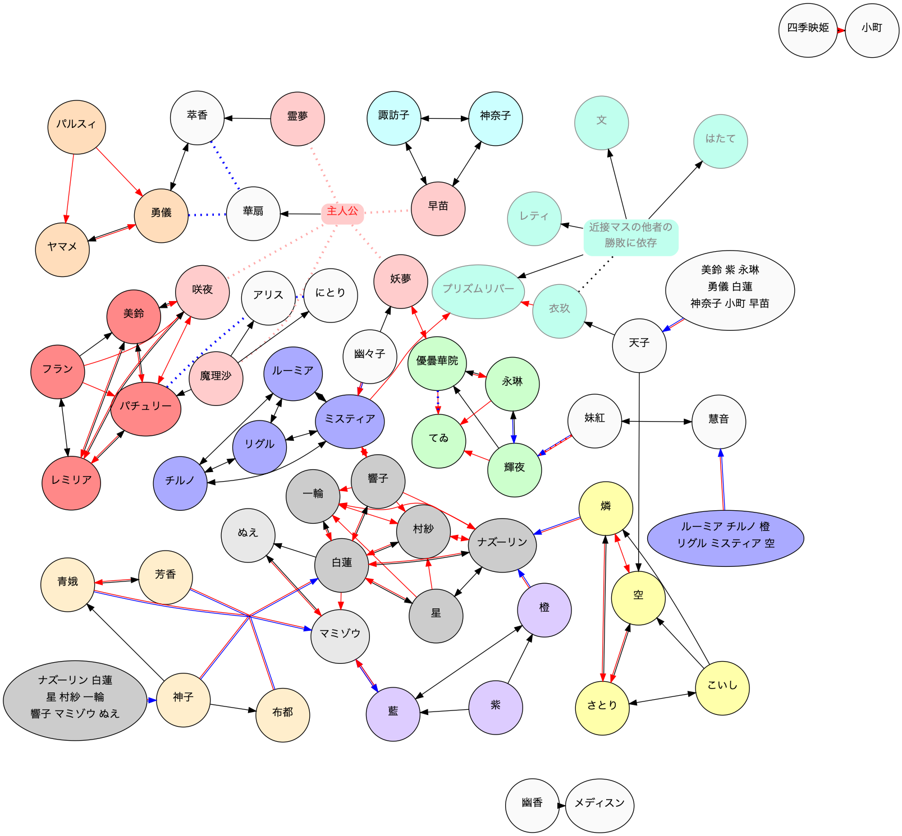
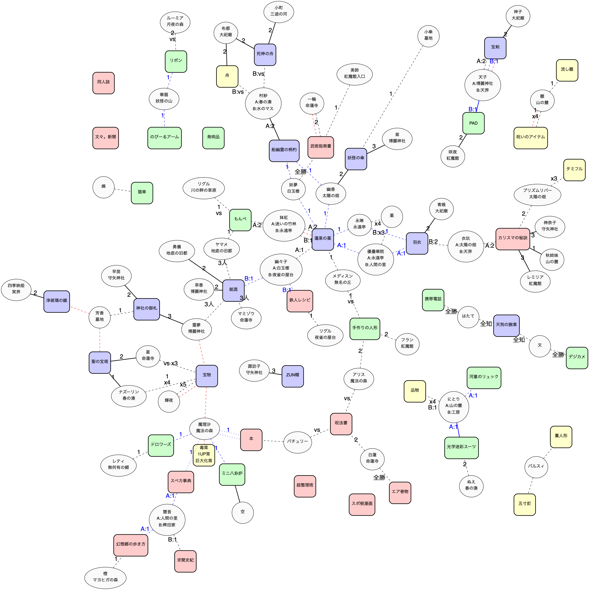

# 東方超人録

東方超人録の非公式電子化のためのリポジトリです.

## [用語説明](./term.md)
用語説明 / 用語説明(戦闘用)

## [クイックリファレンス](./quickreference.md)
行動 / アイコン説明

## [イベント判定表](./event.md)
イベント判定表 /  トラップ判定表 / アクシデント判定表

## [判定表](./reference.md)
香霖堂判定表 / 図書館判定表 / 工房判定表 / 品物表 / NPC戦闘対応表

## [アイテム詳細](./item.md)
全アイテムの詳細表

## [キャラクター耐性一覧](./chara-regist.md)
迷い 呪い 幻覚 毒茸 食あたり 能力低下 飲み過ぎ 天狗警備隊 に対する耐性の表 /
残機減少無効の表 / その他耐性・無効化一覧

## [キャラクター戦闘能力一覧](./chara-battle.md)
戦闘回避能力 / 戦闘時の能力 / 戦闘時の特殊能力

## [キャラクター特殊能力一覧](./chara-ability.md)
デメリット能力 / 近隣の他者への干渉能力 / 地形カードへの干渉能力 /
地形カード関連の特殊能力 / アイテム関連の特殊能力 / その他の特殊能力

## [キャラクタ一覧](./character.md)
勝利・敗北条件 /仲間 / 隣接判定 / 種族

## [戦闘カード詳細](./attack.md)
弾幕カード / 回避カード / 防御・反撃カード / 戦闘補助カード / 特殊カード

## [勝利/敗北条件連鎖図](./rensa.md)

## [勝利/敗北条件アイテム相関図](./match.md)

