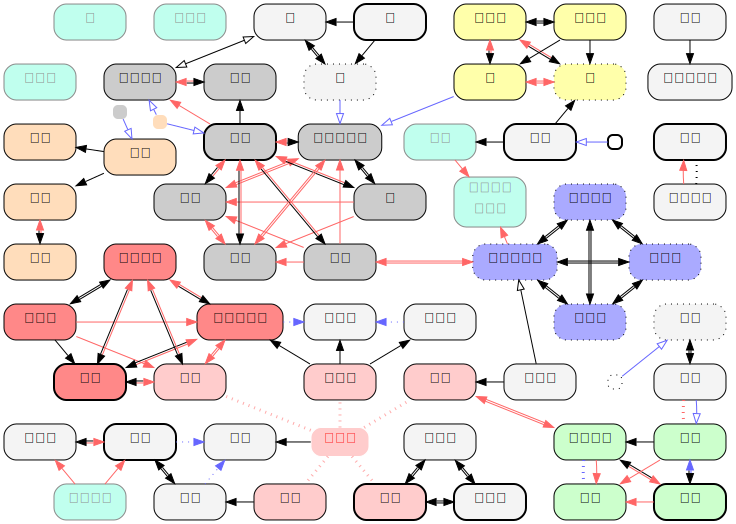
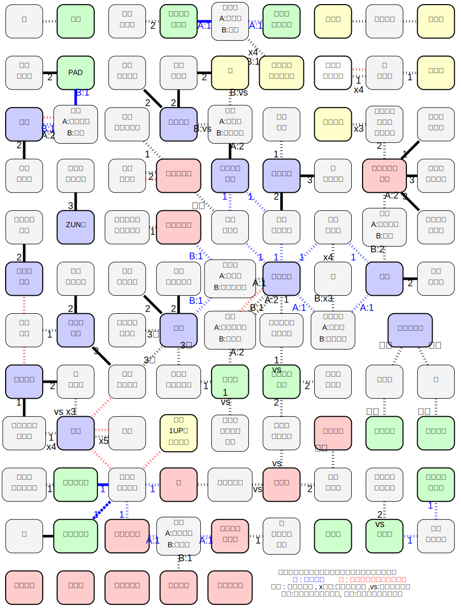

# 東方超人録
## [意思決定用チャート](./doc/chart.md)
## [キャラクター勝利・敗北条件](./doc/character.md)
## [FAQ](./doc/faq.md)
### [細々としたFAQ](./doc/faq2.md)

echo -n "choujinroku" | shasum
4190384711549a3e1d6d8c9de5cdc0b6a96ed31c
http://sagisawa.0am.jp/choujinroku
choujinroku
48ydP9ZcLuCC8c2R

https://www65.atwiki.jp/choujinroku/pages/12.html

https://img.atwikiimg.com/www65.atwiki.jp/choujinroku/attach/19/2/match.png
https://img.atwikiimg.com/www65.atwiki.jp/choujinroku/attach/19/1/rensa.png

# ゲームデータ
## [クイックリファレンス](./doc/quickreference.md)
## [アイテムカード](./doc/item.md)
## [戦闘カード](./doc/attack.md)
## [判定表](./doc/reference.md)
## [地形カード](./doc/map.md)
## [キャラクター・仲間カード](./doc/chara.md)
## [キャラクター耐性表](./doc/chara-regist.md)
## [キャラクター特殊能力表](./doc/chara-ability.md)
## [キャラクター戦闘時能力表](./doc/chara-battle.md)

## Question 一覧

# 戦闘系
Q:B1. チルノ・空の「LV6のスペカで勝利する」は「神の風」でLV6に変更しても満たされますか？素でLV6のスペカを頑張って出したのに,相手にLVを下げられ(かつ,相手が敗北した)た場合はどうなりますか？
A: 「ＬＶ６の状態でスペカが相手に当たれば」ＯＫです。つまり、前者は○、後者は×ですね。

Q:B2. 手札7枚になると手札が1枚増えるは同義ですか？例えば美鈴が7枚にする時に,レティに手札を減らされた後に行うのとレティに手札を減らされる前に行うのとで有利度が変化します.
A: 同義ではありません。このゲームでは、「増える／減る」と「なる」は明確に意味が異なります。レティの能力の後で美鈴がＢ能力を使えば、精神力７手札７枚に「なり」ます。美鈴のスペカは「7枚になる」なので反撃された時に使用することで手札をMaxまで補充できるので,かなり強い.

Q:B3. 「〜の時LVを5にできる」は,元のLVで魔力消費・出せるかチェックの処理をした後LVを上げるということで,「LVを1上げる」「常識にとらわれてはいけないのですね」も同様,要は判定->魔力消費->変更->上昇の順でよろしいですね？
A: はい

Q:B4. リグルのB戦「回避してもゾロ目で残機減少(戦闘勝利履歴を得る)」は,有効だった場合,通常通りの戦闘後の処理を行いますか(アイテムを奪えますか？)
A: はい

Q:B5. イナバのボム能力「相手は無作為に選んだ2枚で攻撃しなければならない」は,「攻撃カードの集合を作り,そのなかから2枚(以下)無作為に引かせる4」という処理でよいと思いますが,エア巻物で上書きできますか？
A: はい

Q:B6. メディスンの戦闘中の判定やり直しの1回だけというのははボムのやり直しと重複しますか？
A: ボムによるやり直しとは別枠で使用できます。手札１枚消費で再判定(失敗)→ボム消費で再々判定、ができます。

Q:B7. 神奈子がG弾幕をだし,コストとして手札を丁度捨てきった場合,「手札を使い切って手札を4枚引く」が発動し,さらにその後「Gを含む弾幕使用時手札を1枚引ける」を発動してもよいですか？
A: はい.その場合結果的に計5枚引けます.

Q:B8. はたての能力でひいてきたスペカを出すには,特殊能力でもボム能力でもLV判定は必要ですか？
A: 念写で山札から引いてきた／捨札から回収してきたスペカを使用する際は、通常のスペカの使用と同様の判定が必要です。

# 勝利条件・敗北条件系
Q:C1 美鈴の「紅のマスの上で主人公に勝つ」は,過去に遡及できないということでよろしいですね？
A: 各種勝利・敗北条件の判定は、過去には遡及しません。正体を知っている状態で勝つか、勝った時に相手の正体を確認する事でのみ成立します。

Q:C2 こいしの勝利条件「盤面の4隅のマスが開いた状態で地霊殿に入る」は,「盤面の4隅のマス」以外は全て開いてある必要がありますよね？
A: 四隅が開いていれば、他のマスはまだ開いていなくてもＯＫです。「幻想郷の歩き方」を持っていると、早いターンでの勝利も可能、という事です。

Q:C3 魔理沙の敗北条件「ドロワーズを奪われる」は,咲夜の交換,アクシデントの妖精の交換,ナズーリン・小傘の破壊等「奪う」と書かれているもの以外では満たされないですね？
A: 戦闘敗北によってアイテムを１つ奪われる際にも成立します。

Q:C4 星の敗北条件「聖の宝塔を落としてしまう」が満たされるのは星の能力で落としてしまう時,イベント4の「落とし物をしてしまった.アイテムを1個無作為で失う」,「移動2で失う」,アクシデント12の「蹴躓いて盛大に転んだ.所持アイテムをすべて失う」,トラップ8の「罠を回避した時にアイテムを落として壊してしまった」だと思いますが,トラップ6の「落とし穴に落ちてアイテムをばら撒く.同じマスに他のPCが居れば,所持 アイテムが無作為に1個入れ替わる」では(PCが居ないときも)(フレーバー的に)満たされますか？
A: トラップ６の時、同じマスに他のＰＣが居れば星は敗北条件を満たしますが、誰も居なければセーフです。トラップ６が発生しても、聖の宝塔が無作為交換の対象とならなければセーフです。「手許からなくなったら敗北」と考えてもらえれば。

Q:C5 パルスィのG能力で勝利条件を敗北条件に書き換えられますが,同人誌や紅色の幻想郷やレミリアに書き換えられた勝利条件を書き換えた場合,その相手の残機が減少して元に戻った場合はどうなりますか？
A: 残機が減少すれば、状態異常は全て解除されます(呪いのアイテムも、捨てるかどうかをその場で決める)。パルスィのＧ能力(呪い属性)も含まれます。

# アイテム系
Q:I1 早苗が飲みすぎて休みになった場合,別の相手のターンで解毒剤を撃って回復させられますか？
A: はい

Q:I2  早苗が飲みすぎて休みになった場合,瞬時に他人が解毒剤を付与して休みに変化させないことはできますか？
A: はい

Q:I3  幽々子が飲みすぎて残機が増えそうになった場合,自分または他人が解毒剤を付与して残機+1を無効にできますか？
A: はい

Q:I4 . 戦闘中は河童のリュックを入れ替えできないとのことで,戦闘に入る前,戦闘後(アイテムを奪われる前)に入れ替えはできますか？
A: いいえ

特殊能力系
Q:E1  「マリアリ」は,「正体を確認した魔理沙が」とは書いていないので,他者の戦闘が発生した時に正体未確認の状態でも,とりあえず「魔理沙だったら代わりにやります〜」と宣言を連呼することは可能ですか？
A: できません。正体確認のマーカーを持っている必要があります。輝夜の「蓬莱ニート」の能力は、「場に永琳が居れば、判定不要で呼び寄せる」能力なので、正体確認マーカーは必要としません。

Q:E2 輝夜の永琳呼び寄せは,「永琳の正体確認後のみ」ダイスを降る前に永琳を召喚することを決定するということでいいですか？また,「呼び寄せる」なので永琳の正体確認後は強制ですか？
Q:E3 輝夜が戦闘を仕掛けられた時,無作為に魔理沙を呼び寄せた場合,さらにアリスが代わりに戦うことはできますか？青蛾が戦闘を仕掛けられ,NPC輝夜が呼び出され,彼女がさらにPC魔理沙を呼び出し,更にアリスが代わりに戦うことが可能だった場合,同じマスにいる布都は何回代わりに戦うサイコロを降ることができますか？
A: 輝夜に魔理沙が呼び寄せられた場合、アリスが魔理沙の正体を知っていればアリスが代わりに戦闘を行なえます。戦闘に関する特殊能力の処理は、まずは当事者から行なうので、布都が判定を行なうのは、例の場合は最後の１回だけという事になります。

Q:E4 (藍などの)ボムで戦闘回避の能力はNPCにも使えるということで,先にボムを使うかめくるかを決めるとのことですが,にとり.は「仕掛けてきたNPCが鬼だった」場合に戦闘を回避できますか？同様に 四季映姫の「幽霊から戦闘を仕掛けられない」は,雑魚幽霊はもちろんPCには「あなたが幽霊なら仕掛けられません」と宣言し,未キャラNPCにはめくった後に幽霊ならやっぱりなしにできますか？同様の質問は妖怪に対する聖にもなされます.
A: ＮＰＣは正体が判っている状態で出てくるので、回避できます。四季映姫・幽々子はできます。白蓮も、判定に成功すれば同様です。

Q:E5 霊夢で空を飛んで大ナマズを回避した場合,なにもない地形の上にいるということですか？その場合,いつめくりますか？それとも残機は減少せずに盤面の外に出るということでよろしいですか？
A: 空を飛ぶ程度の能力の判定に成功した場合、何もない地形上に居る事になります。その場合、他者が同じマスに入ってくるか、自分の手番で「移動１」以外を選択してそのマスに留まる時にめくります。

Q:E6 小町の「残機を1減らすを残機を1に」はトドメを刺せる時に刺さないようにもできるということでよいですか？
A: はい

Q:E7 衣玖がダイスをボムで反転する時,2回ボムを使えば両方反転できますか？
A: いいえ.１つのダイスロールには、ボムは１つまでしか使えません。

Q:E8 天子の精神力+1は,相手が「美鈴...白蓮」なら私の精神力があがります,と宣言できますか？
A: 相手の正体確認カウンターを持っている必要があります。

Q:E9 メディスン・村紗には「自分」の手番終了時に残機を減らすと書いてありますが,フランには書いていません.つまり,フランは他人のターンでもこの能力を発動させることができますか？
A: これはテキストが悪いですね.発動タイミングは村紗とフランは同等に自分の手番のみです.(メディスンとは発動タイミングが異なります。)

Q:E10  村紗の残機減少能力や,ヤマメの手番数制限能力は,「あなたがが<キャラクター名...>なら無効です」と(正体を確認できていないときでも)宣言する必要がありますか？また,相手はそれに従う必要はありますか？(「できる」ではないため)
A: 対象の正体を確認していない状態で使うなら、宣言する必要があります。

Q:E11 勇儀のB能力で相手を「最も直線で遠い外周マスに移動させる」は,既に開いているマスのみが対象でしょうか？その場合,慧音が端の地形を全て食べていた場合どうなりますか？開いていないマスでいい場合,新しく地形を開いて良いですか？
A: 該当する外周に「開いている」マスがなければ、新しく地形を開きます。飛ばされた者はその時点ではマスの指示には従いません。マスの属性(水・森・花等)の影響は受けます。

Q:E12 布都がボムで発動した地形効果を無視することができるのはいつまでですか？トラップの結果を見てからでも無視するこ
とはできますか
A: 地形効果によって、各種判定を振る事になる前までです。トラップの場合は、２Ｄの出目を見てから無視する事ができます。トラップ５で２Ｄの判定に失敗してからではダメ、という事です。

Q:E13 一輪の能力に「武術では残機が減らない」がありますが,未使用NPC(残機1)の一輪を武術で倒してしまった場合は残機を減らせますか？減らさずに退出してもらうという処理でよいですか？(別のキャラの連鎖敗北に関わるためにあえて武術で倒す可能性がある).その場合,2Dで満身創痍から復活できるバカルテット等も同様の処理をする可能性がありますか？
A: 減らせません。　バカルテットも判定に成功すれば扱いとしてはこれに準じます。

Q:E14 ミスティアのB戦だけ「能力低下 & 幻覚」マークがついていますが,これは能力低下も幻覚も無効じゃないと無効化できないもしくは片方だけ無効であればそれで大丈夫なのかどちらでしょうか？
A: どちらかに耐性があれば無効となります。今更ながら、①と③を幻に、②を低にすれば良かったかも(^^;

状況が発生するとやばい系
Q:X2 アイテムを1つ持った文が秋姉妹と同じマスにおり,秋姉妹がカリスマの秘訣を持って山の麓に入って勝利した時,かつアイテムを一つも持っていないパルスィは勝利条件1,2,敗北条件1,2を満たしていないとする.このとき,パルスィは敗北条件3が 満たされるので敗北するため,連鎖して秋姉妹は敗北し,さらに文も敗北するので,パルスィは勝利する.パルスィは特別にこの敗北とこの勝利があるとき勝利できる.パルスィは勝利したので秋姉妹の敗北条件は適用されなくなり,文も勝利するので敗北者が0人になり,パルスィは敗北する...と勝利・敗北が永遠にループすることになりますがどうしましょう.
A: 同時に２人以上が勝利する、を一時的にではあるが満たしてしまったので、パルスィの敗北条件が成立(敗北条件は勝利条件に優先)する、という感じですね。同時に２人以上が勝利する、を一時的にではあるが満たしてしまったので、パルスィの敗北条件が成立(敗北条件は勝利条件に優先)する、という感じですね。パルスィは主人公以外では数少ないＧ能力持ちだったりはするのですが。河童のリュックをどうにかできる数少ない存在だったり(笑)。

Q:X1 1回の戦闘で108枚戦闘カードを使い切りました.
A: 配る戦闘カードが足りない場合、捨札をすべて切り直し、新たな山札としてください。108枚使い切りを無限にできる場合,無限１回の戦闘では、捨札を集めて新たな山札を作るのは１回だけ」とかするといいかも
Q:X3 「デジカメを持った藍 」が「最後の地形カードを開いてかつ普通に勝利した者と一緒に居た」場合のマミゾウの勝敗はどうなりますか？藍のデジカメ連鎖を一瞬満たすで敗北でしょうか？それとも藍自体はデジカメ関係なく敗北なので勝利でしょうか？
A: 藍は(紫・橙以外が)最後の地形カードを開いた者が勝利した時点で(他に勝利条件があっても敗北条件優先の原則で)敗北ですので、「場に白蓮／ぬえが居ない限り」、藍敗北でマミゾウ勝利です。

# ****

1. レミリアのG常は「レミリアが勝利する」と宣言する必要がありますか？(「私が勝利する」ではないのでキャラシートを交換されてしまった場合では「レミリア」が勝利として引き継ぎますか？)
- はい
10. てゐ,魔理沙が同時にトラップを反転しようとした場合,速いもの勝ちでよいですね？
- はい
100. 妹紅は「毒茸では残機が減らない」なので「無効にできる」というわけではないですね？
- はい
11. 幽香の「回避▼:切」はレティと同様に自分に対してですね？
- はい
111. 雛・レミリアなどの他者の判定結果の上書きは宣言順でよいですか？(アクション性がでますね)
- はい

