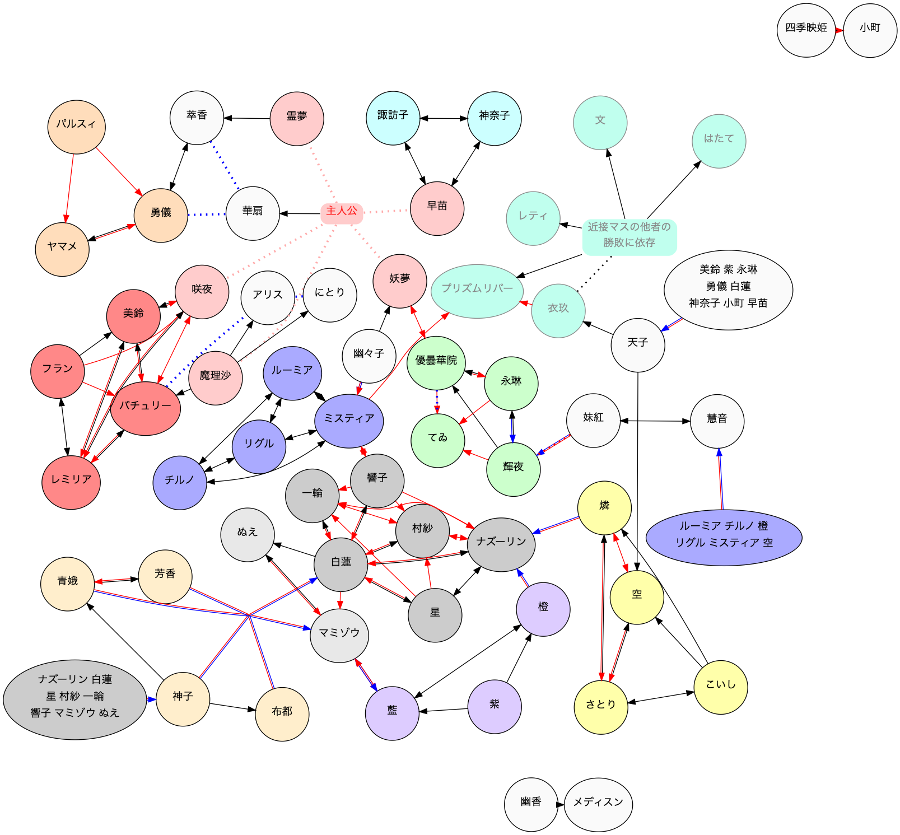

# 勝利/敗北条件連鎖図

A -> B
- 赤矢印 : Aが勝つと Bも勝利
- 青矢印 : Aが負けると Bも敗北
- 黒矢印 : Aが勝つとBも勝ち.Aが負けるとBも負け.
- ドット矢印 : A の状況によって,Bの勝敗が決まる可能性がある.
- 赤青矢印 : Aが勝つと B は敗北

- バカルテットなど,黒色の関係は,一蓮托生な関係.
- 命蓮寺など,赤色が多い関係は,負けても気にしないが勝ったら勝ちな気楽な関係.
- 赤黒が多い関係は主従関係が多い.
- 青黒の関係は 輝夜・永琳のみで珍しい関係.